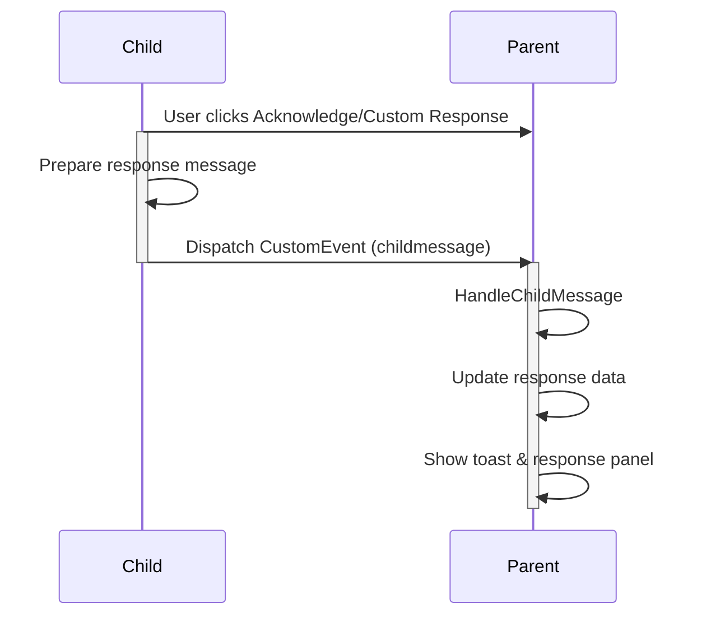

# Salesforce LWC Parent-Child Communication Demo 🚀

A Lightning Web Component demonstrating sophisticated communication patterns between parent and child components with interactive UI elements.

## 🌟 Overview

This Lightning Web Components (LWC) demo showcases advanced parent-child communication techniques, highlighting seamless data flow and interactive UI design.

### 📐 UI Architecture

```
PARENT COMPONENT                        CHILD COMPONENT
[Input Field]                           [Message Display]
[Send Message Button]                   [Acknowledge Button] 
[Message Status]                        [Custom Response Button]
                                       ┌─────────────────────┐
RESPONSE PANEL                         │ Custom Response Modal │
[Response Display]                     │ [Text Area]           │
[Timestamp]                            │ [Send/Cancel Buttons] │
                                       └─────────────────────┘
```

## 🚀 Key Features

- 🎯 **Bi-Directional Communication**: Seamless message passing between components
- 📨 **Message Validation**: Robust input handling and transmission
- ✅ **Dynamic Acknowledgments**: Pre-defined and custom response mechanisms
- ⏱ **Response Tracking**: Timestamp logging for each interaction
- 🔄 **State Management**: Comprehensive reset and tracking functionality
- 🎉 **User Feedback**: Toast notifications for enhanced user experience

## 🔄 Communication Flow

### Parent → Child Communication

1. User enters message in parent input field
2. Parent component updates `parentMessage` property
3. "Send Message" button triggers `sendToChild()` method
4. Child receives message via `@api parentMessage`
5. Child displays received message with dynamic status badge

### Child → Parent Communication



## 🧩 Component Breakdown

### 🔹 Parent Component (`parentComm`)

#### Elements

| Element | Description |
|---------|-------------|
| Message Input | Collects user input for child component |
| Send Message Button | Validates & transmits message to child |
| Reset Button | Clears entire communication history |
| Response Panel | Displays child responses with timestamps |

#### Key Methods

```javascript
// Validate and send message to child
sendToChild() {
    // Validation logic
    // Message transmission
}

// Process incoming child responses
handleChildMessage() {
    // Response handling
    // Timestamp recording
}

// Clear all communication state
resetMessages() {
    // State reset
    // History clearance
}
```

### 🔹 Child Component (`childComm`)

#### Elements

| Element | Description |
|---------|-------------|
| Status Badge | Displays message reception state |
| Acknowledge Button | Sends pre-defined confirmation |
| Custom Response Button | Opens modal for personalized replies |
| Response Modal | Collects and sends custom messages |

#### Key Methods

```javascript
// Send pre-defined acknowledgment
sendAcknowledgment() {
    // Trigger standard response
}

// Handle custom message submission
sendCustomResponse() {
    // Custom message processing
}

// Dispatch response event to parent
dispatchResponseEvent() {
    // CustomEvent creation
    // Event dispatching
}
```

## 📦 Installation

1. Clone the repository
2. Set up Salesforce DX project
3. Deploy components to your org

## 🤝 Contributing

Contributions are welcome! Please read our contributing guidelines before submitting pull requests.

## 📄 License

This project is licensed under the MIT License.

---

**Built with ❤️ using Salesforce Lightning Web Components**
